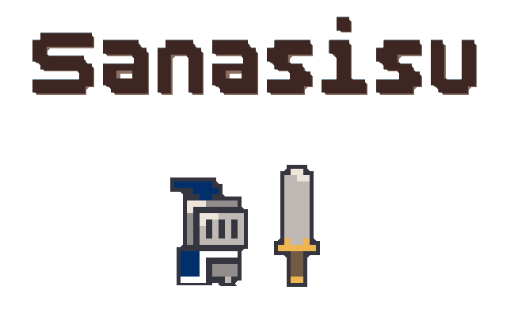
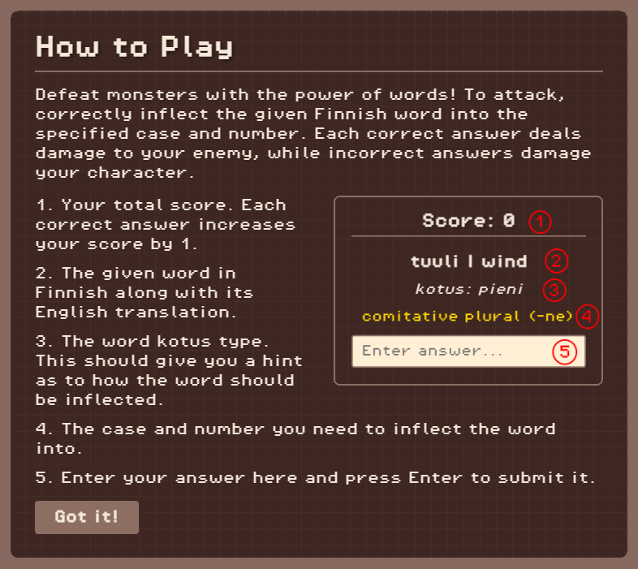

<div id="top"></div>
<!-- PROJECT LOGO -->
<br />
<div align="center">
  <a href="https://github.com/ioanat94/sanasisu">
    
  </a>

  <p align="center">
    A browser game to practice Finnish noun inflection.
    <br />  
  </p>

  [Play for free on itch.io!](https://ioanat94.itch.io/sanasisu)
</div>

<!-- TABLE OF CONTENTS -->
<details>
  <summary>Table of Contents</summary>
  <ol>
    <li>
      <a href="#about-the-project">About The Project</a>
      <ul>
        <li><a href="#built-with">Built With</a></li>
      </ul>
    </li>
    <li>
      <a href="#run-locally">Run Locally</a>
      <ul>
        <li><a href="#prerequisites">Prerequisites</a></li>
        <li><a href="#installation">Installation</a></li>
      </ul>
    </li>
    <li><a href="#how-to-play">How to Play</a></li>
    <li><a href="#contact">Contact</a></li>
  </ol>
</details>

<!-- ABOUT THE PROJECT -->
## About The Project

<p align="center">  
  <br />  
  <br />  

Sanasisu is a game where you defeat monsters with the power of words! To attack, correctly inflect the given Finnish word into the specified case and number. Each correct answer deals damage to your enemy, while incorrect answers damage your character.

Your progress is saved locally to your browser after every answer. As long as you don't clear your browser storage, you can always come back and pick up right from where you left off!

<p align="right">(<a href="#top">back to top</a>)</p>

### Built With

* [Phaser](https://phaser.io/)
* [Typescript](https://www.typescriptlang.org/)
* [React.js](https://reactjs.org/)
* [Vite](https://vite.dev/)

<p align="right">(<a href="#top">back to top</a>)</p>

<!-- RUN LOCALLY -->
## Run Locally

To get a local copy up and running follow these simple steps.

### Prerequisites

* npm  
  <br /> 
  ```sh
  npm install npm@latest -g
  ```

### Installation

1. Clone the repo  
   <br /> 
   ```sh
   git clone https://github.com/ioanat94/sanasisu.git
   ```
2. Install NPM packages  
   <br /> 
   ```sh
   npm install
   ```
3. Start the app  
   <br /> 
   ```sh
   npm run dev
   ```

<p align="right">(<a href="#top">back to top</a>)</p>

<!-- HOW TO PLAY -->
## How to Play

 

<p align="right">(<a href="#top">back to top</a>)</p>

<!-- CONTACT -->
## Contact

Ioana Tiplea - ioanatiplea94@gmail.com  - [LinkedIn](https://www.linkedin.com/in/ioana-tiplea/)  
Itch.io Link - [https://ioanat94.itch.io/sanasisu](https://ioanat94.itch.io/sanasisu)  
Project Link: [https://github.com/ioanat94/sanasisu](https://github.com/ioanat94/sanasisu)  

<p align="right">(<a href="#top">back to top</a>)</p>
